### Tensorflow

##### Tensors ?

 > basically ndarray

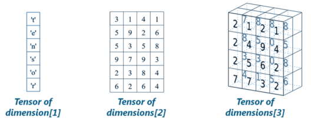


##### TensorFlow ?
**TensorFlow = Tensor + Flow**
 > basically data + ops

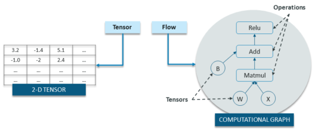

##### 代码组织方式

2步:

- 构建计算图(Graph)
- 运行计算图

###### 1. 构建计算图

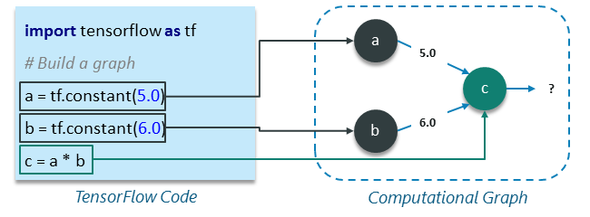
- a, b, c 都称为 node.
- 每个 node 上的 operation 可以 parallel。
- 与 spark 类似，这时候什么也不做。

###### 2. 运行计算图

``` python
import tensorflow as tf

# Build a graph
a = tf.constant(5.0)
b = tf.constant(6.0)
c = a * b
```

- 需要一个 session
- session 用来将 graph operations 分配到 Devices(GPU, CPU) 上去。

```python
# Create the session object
sess = tf.Session()

#Run the graph within a session and store the output to a variable
output_c = sess.run(c)

#Print the output of node c
print(output_c)

#Close the session to free up some resources
sess.close()
```

> Output: 30

##### Constants, Placeholder and Variables

###### 1. Placeholder
> feed 外部数据
```python
import tensorflow as tf

# Creating placeholders
a = tf. placeholder(tf.float32)
b = tf. placeholder(tf.float32)

# Assigning multiplication operation w.r.t. a &amp;amp; b to node mul
mul = a*b

# Create session object
sess = tf.Session()

# Executing mul by passing the values [1, 3] [2, 4] for a and b respectively
output = sess.run(mul, {a: [1,3], b: [2, 4]})
print('Multiplying a b:', output)
```
> Output: [2. 12.]

- Placeholders 不会被初始化并且里面没有数据。
- 运行期必须给 placeholder 喂数据，不然会报错。

###### 2. Constants, Variables

> Variables 是 trainable 的(也就是在运行期不断被改变的数据)
> Constants 的值是固定不变的。

```python
var = tf.Variable( [0.4], dtype = tf.float32 )
```

``` python
init = tf.global_variables_initializer()
sess.run(init)
```

##### Linear Regression
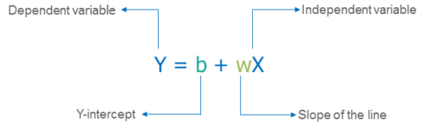

###### 1. build graph
```python
import tensorflow as tf

W = tf.Variable([.4], tf.float32)

b = tf.Variable([-0.4], tf.float32)

x = tf.placeholder(tf.float32)

linear_model = W * x + b

sess = tf.Session()
init = tf.global_variables_initializer()
sess.run(init)

print(sess.run(linear_model, {x: [1, 2, 3, 4]}))
```

> Output: [ 0.     0.40000001 0.80000007 1.20000005]

###### 2. define loss function

```python
y = tf.placeholder(tf.float32)

error = linear_model - y

squared_errors = tf.square(error)

loss = tf.reduce_sum(squared_errors)

print(sess.run(loss, {x:[1,2,3,4], y:[2, 4, 6, 8]})
```

> Output: Output: 90.24

###### 3. train
```python

optimizer = tf.train.GradientDescentOptimizer(0.01)

train = optimizer.minimize(loss)

for i in range(1000): // 执行 1000 次梯度下降
     sess.run(train, {x:[1, 2, 3, 4], y:[2, 4, 6, 8]})

print(sess.run([W, b]))
```

> Output: Output:
 [array([ 1.99999964], dtype=float32), array([ 9.86305167e-07], dtype=float32)]


##### Embedding

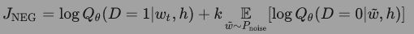

> **我真的非常喜欢这部电影，情节一流啊。**
```python
# 分词
[我, 真的, 非常, 喜欢, 这部, 电影, 情节, 一流]

=== win length 2 ==>

([我, 非常], 真的), ([真的, 喜欢], 非常), ([非常, 这部], 喜欢), ...


=== (input, label) ==>

(真的, 我), (真的, 非常), (非常, 真的), (非常, 喜欢), ...
```
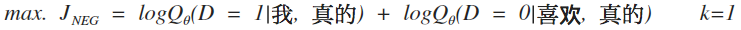

> 这个公式的意思是：在数据集D中，让"真的"和"我"离近点，"真的"和"喜欢"离远点。

> CODE

##### FFM

###### Linear Model

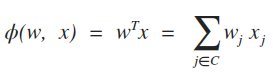

- w 参数
- x 数据
- C 是 x 中不为 0 的元素集合

---

###### Poly 2

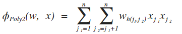

- C 是 非0 x1, 非0 x2 的组合

---

###### FM
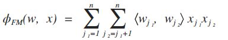

- wj1, wj2是两个向量, 长度为k(超参数), 两者的内积来表明两个feature之间的关系

---

###### FFM
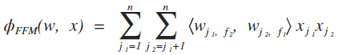

- f1, f2 分别是 j1, j2(feature) 的field, wj1f2, wj2f1 是长度为k的两个向量

---

###### FM & FFM

| | #variables | complexity |
| --- | --- | --- |
| FM | nk | O(nk) |
| FFM | nfk | O(n^2*k) |

---

###### Loss
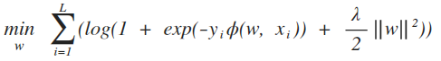

- L 是记录数, lambda 是正则系数

###### Example
| UserId | Item | Category | Country |
| --- | --- | --- | --- |
| zapya | 后天 | 科幻 | CN |

> **PHI(w, x)**

**Linear**

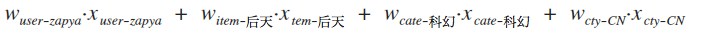

---

**Poly2**

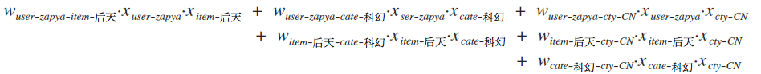

---

**FM**

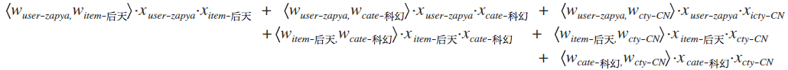

---

**FFM**

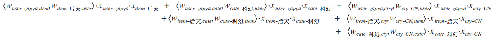

| Fieldname Fieldindex | Featurename      Featureindex |
| --- | --- |
|  UserId  ------> <font color=red  face=“黑体”>1</font>|   zapya --------------> <font color=blue  face=“黑体”>1</font> |
|  Item  ------> <font color=red  face=“黑体”>2</font>|   后天 --------------> <font color=blue  face=“黑体”>2</font> |
|  Category  ------> <font color=red  face=“黑体”>3</font>|   科幻 --------------> <font color=blue  face=“黑体”>3</font> |
|  Country  ------> <font color=red  face=“黑体”>4</font>|   CN --------------> <font color=blue  face=“黑体”>4</font> |

数据格式最终为:

<font color=red  face=“黑体”>1</font>:<font color=blue  face=“黑体”>1</font>:<font color=green  face=“黑体”>1</font>
<font color=red  face=“黑体”>2</font>:<font color=blue  face=“黑体”>2</font>:<font color=green  face=“黑体”>1</font>
<font color=red  face=“黑体”>3</font>:<font color=blue  face=“黑体”>3</font>:<font color=green  face=“黑体”>1</font>
<font color=red  face=“黑体”>4</font>:<font color=blue  face=“黑体”>4</font>:<font color=green  face=“黑体”>1</font>

> FFM Phi(w, x) =>

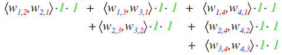

---
[Github Tensorflow Tutorial Project](https://github.com/Hvass-Labs/TensorFlow-Tutorials)
